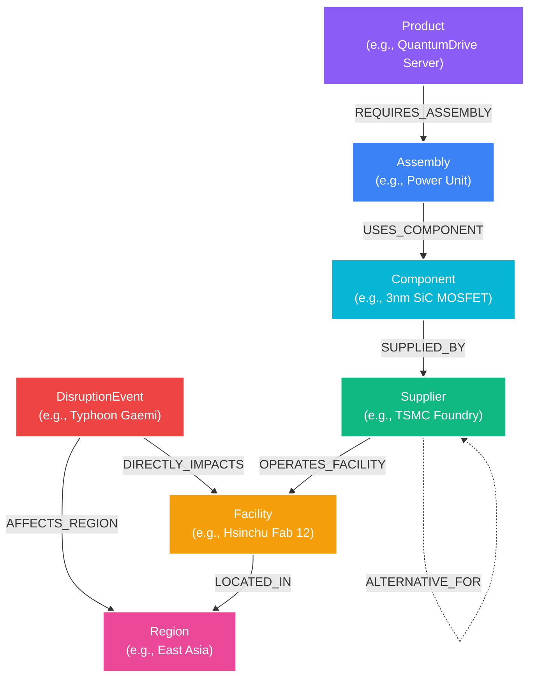

# 🌐 Vanguard | Global Supply Chain Risk Graph Intelligence Engine
> **Candidate Take-Home Assignment for Wexa AI**
> Powered by **CognoDB Cloud** (openCypher / Neo4j Bolt Driver) and a high-performance **FastAPI + Cytoscape.js** Web Application.

---

## 🎯 Use Case Overview
**Vanguard** is an enterprise supply chain resilience and disruption risk analytics engine. 

In global manufacturing, enterprise products (servers, electric vehicle battery packs, avionics, routers) rely on complex multi-tier supply networks spanning assemblies, components, primary suppliers, overseas fabrication facilities, and regional logistics hubs. When a geopolitical crisis or extreme weather event (e.g. a typhoon closing a port in East Asia or an energy grid outage in Europe) strikes, leadership must immediately answer:
1. **Multi-Hop Disruption Blast Radius**: *Which final products, assemblies, and revenue streams are impacted across Tier 1 to Tier 4 suppliers?*
2. **Single Point of Failure (SPOF) Analysis**: *Which components rely on sole-source suppliers where a single facility shutdown halts product lines?*
3. **Alternate Supply Routing**: *What 2-hop backup supplier paths exist with minimal switching lead time?*

---

## 🧠 Why a Graph Database? (Relational vs. Graph Schema)

Modern supply chains are **networks of relationships**, not flat tables.

| Aspect | Relational Database (SQL) | Graph Database (CognoDB / openCypher) |
| :--- | :--- | :--- |
| **Multi-Hop Traversal (4-5 Hops)** | Requires deep, slow SQL `JOIN`s or complex recursive Common Table Expressions (`WITH RECURSIVE`). Extremely brittle and difficult to maintain. | Native variable-length path matching `(Disruption)-[*1..5]->(Product)` expressed in 1 line of Cypher. |
| **Schema Flexibility** | Schema migrations required whenever new entity types or metadata properties are added. | Property graph model accommodates new node labels and relationship properties dynamically without downtime. |
| **Pathfinding & Alternate Routes** | Complex graph algorithms (shortest path, bottleneck discovery) are computationally expensive and awkward in relational engines. | In-memory index-free adjacency enables traversal in milliseconds regardless of network depth. |
| **Query Clarity** | 50+ lines of SQL with nested subqueries and joins. | Declarative Cypher pattern matching `(c:Component)-[:SUPPLIED_BY]->(s:Supplier)`. |

---

## 📐 Graph Data Model Diagram



### Node Labels & Key Properties:
- `:Product` (`id`, `name`, `category`, `quarterly_revenue_m`)
- `:Assembly` (`id`, `name`, `complexity`)
- `:Component` (`id`, `name`, `category`, `is_sole_source`)
- `:Supplier` (`id`, `name`, `tier`, `rating`)
- `:Facility` (`id`, `name`, `type`)
- `:Region` (`id`, `name`, `risk_index`)
- `:DisruptionEvent` (`id`, `name`, `severity`, `type`)

### Typed Relationships & Properties:
- `(:Product)-[:REQUIRES_ASSEMBLY {quantity: Int}]->(:Assembly)`
- `(:Assembly)-[:USES_COMPONENT {quantity: Int}]->(:Component)`
- `(:Component)-[:SUPPLIED_BY {lead_time_days: Int, cost_usd: Float}]->(:Supplier)`
- `(:Supplier)-[:OPERATES_FACILITY]->(:Facility)`
- `(:Facility)-[:LOCATED_IN]->(:Region)`
- `(:DisruptionEvent)-[:AFFECTS_REGION {severity: String}]->(:Region)`
- `(:Supplier)-[:ALTERNATIVE_FOR {switching_days: Int, added_cost_percent: Float}]->(:Supplier)`

---

## ⚡ Main Cypher Queries Explained

### 1. Multi-Hop Disruption Blast Radius (4-5 Hops)
*Traverses from a disruption event down to affected regions, facilities, suppliers, components, assemblies, and final products, calculating financial exposure:*
```cypher
MATCH (d:DisruptionEvent {id: $disruption_id})
MATCH (d)-[:AFFECTS_REGION|DIRECTLY_IMPACTS*1..2]->(target)
MATCH path = (target)-[:OPERATES_FACILITY|SUPPLIED_BY|USES_COMPONENT|REQUIRES_ASSEMBLY*1..4]->(p:Product)
RETURN d.name as disruption,
       target.name as target_area,
       p.name as affected_product,
       length(path) as hops,
       nodes(path) as path_nodes,
       sum(p.quarterly_revenue_m) as revenue_at_risk_m
```

### 2. Single Point of Failure (SPOF) & Bottleneck Discovery
*Identifies components with sole-source suppliers that expose downstream revenue streams:*
```cypher
MATCH (c:Component)-[:SUPPLIED_BY]->(s:Supplier)
WITH c, collect(s) as suppliers
WHERE size(suppliers) = 1
MATCH (p:Product)-[:REQUIRES_ASSEMBLY|USES_COMPONENT*1..2]->(c)
RETURN c.id as component_id,
       c.name as component_name,
       suppliers[0].name as sole_supplier,
       collect(DISTINCT p.name) as affected_products,
       count(DISTINCT p) as product_count,
       sum(p.quarterly_revenue_m) as revenue_at_risk_m
ORDER BY revenue_at_risk_m DESC
```

### 3. Multi-Hop Alternate Supply Path Discovery
*Finds 2-hop backup supplier routes with minimum switching lead time when a primary supplier fails:*
```cypher
MATCH (c:Component)-[:SUPPLIED_BY]->(primary:Supplier {id: $supplier_id})
MATCH (alt:Supplier)-[rel:ALTERNATIVE_FOR]->(primary)
RETURN c.name as component,
       primary.name as primary_supplier,
       alt.name as alt_supplier,
       alt.rating as alt_rating,
       rel.switching_days as switching_days,
       rel.added_cost_percent as extra_cost_pct
ORDER BY rel.switching_days ASC
```

---

## 🚀 Setup & Run Instructions

### 1. Provision CognoDB Cloud Instance
1. Go to [https://console.cognodb.com/signup](https://console.cognodb.com/signup) and create a free account.
2. Click **Create Instance** and pick a free (`c0`) region. It provisions in under 60 seconds.
3. Copy your connection details:
   - **Connection URI**: `bolt+s://<instance-id>.databases.cognodb.cloud`
   - **Username**: `cognodb`
   - **Password**: *(generated password shown once)*

### 2. Configure Environment Variables
Copy `.env.example` to `.env` and fill in your CognoDB Cloud credentials:
```bash
cp .env.example .env
```
Edit `.env`:
```ini
COGNO_URI=bolt+s://<instance-id>.databases.cognodb.cloud
COGNO_USER=cognodb
COGNO_PASSWORD=your_saved_password_here
PORT=8000
```

> *Note: If `.env` credentials are not configured, the application seamlessly activates an **In-Memory Demo Engine** with identical graph structure so all UI visualizers, simulations, and Cypher console functions work out-of-the-box.*

### 3. Install Dependencies
```bash
pip install -r requirements.txt
```

### 4. Seed CognoDB Database
Run the automated seed script to populate CognoDB Cloud with baseline supply chain data:
```bash
python seed.py
```

### 5. Launch the Web Application
Start the FastAPI server:
```bash
python backend/main.py
```
Open your browser at **`http://localhost:8000`**.

---

## 🎨 UI/UX Features Walkthrough

1. **Interactive 2D Graph Visualizer**: Built with Cytoscape.js force-directed physics. Drag nodes, zoom/pan, search nodes by keyword, and inspect property tables in the right inspector panel on click.
2. **Multi-Hop Disruption Blast Radius Simulator**: Select a crisis event (e.g. Typhoon Gaemi Port Closure) and click *Simulate Blast Radius* to visually animate affected multi-hop paths in crimson and view total impacted revenue.
3. **Single Source Vulnerabilities Matrix**: Run graph pattern matching to isolate sole-sourced components and high-risk supplier dependencies.
4. **Backup Supply Route Finder**: Traverses alternate supplier paths `(:Supplier)-[:ALTERNATIVE_FOR]->(:Supplier)` with switching days and cost delta rankings.
5. **Live openCypher Console**: Write and execute custom Cypher statements with tabular results formatting and graph canvas integration.
6. **Real-time CognoDB Status Indicator**: Visual pill badge indicating live CognoDB Cloud connectivity vs. fallback demo state.

---

## 📁 Repository Structure

```
d:\test\graph db/
├── .env.example              # Credentials template
├── .gitignore                # Protect secrets (.env)
├── requirements.txt          # Python dependencies (neo4j, fastapi, uvicorn)
├── seed.py                   # Automated Cypher dataset seeder script for CognoDB
├── README.md                 # Complete documentation, architecture & Cypher guide
├── backend/
│   ├── __init__.py
│   ├── config.py             # Environment configuration manager
│   ├── database.py           # Neo4j driver session manager & Cypher query engine
│   ├── queries.py            # Parameterized openCypher queries
│   └── main.py               # FastAPI REST endpoints & static file server
└── frontend/
    ├── index.html            # Dashboard markup layout
    ├── styles.css            # Dark mode glassmorphic UI design system
    └── app.js                # Frontend logic & Cytoscape graph canvas renderer
```

---

## 🏆 Summary of Submission Criteria Met
- [x] **CognoDB Cloud & Neo4j Driver**: Standard `neo4j` Python driver connecting over `bolt+s://` protocol.
- [x] **Data & Queries**: 7 labeled node types, 7 typed relationship types with properties, multi-hop traversals (up to 5 hops), parameterized Cypher statements.
- [x] **Seeding**: Standalone executable `seed.py` loading realistic multi-tier supply chain data into CognoDB.
- [x] **UI/UX Excellence**: Modern glassmorphic dark mode dashboard with Cytoscape.js graph visualizer, inspector panel, and disruption simulator.
- [x] **Engineering & Security**: Environment secrets read from `.env`, clean modular backend architecture, and graceful fallback handling if database is unreachable.
